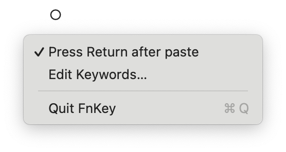
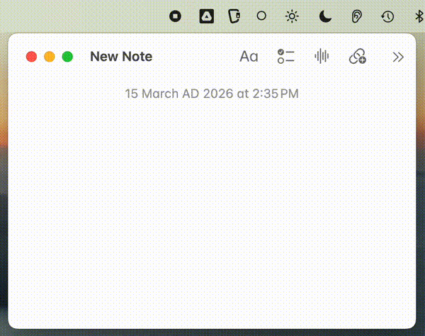

# FnKey.app

A tiny Rust menu bar app for macOS. Hold Fn, speak, paste. Microphone is only active while you hold the key — you'll see the yellow mic indicator in macOS as confirmation.

<p align="center"></p>

<p align="center"></p>

If you find FnKey useful, please [star the repo](https://github.com/evoleinik/fnkey) — it helps others discover it.

## Install

1. Download from [Releases](https://github.com/evoleinik/fnkey/releases):
   - **Apple Silicon** (M1/M2/M3): `FnKey-arm64.zip`
   - **Intel**: `FnKey-x64.zip`

2. Unzip and move to Applications:
   ```bash
   unzip FnKey-arm64.zip
   mv FnKey.app /Applications/
   ```

3. Set your API key(s):
   ```bash
   mkdir -p ~/.config/fnkey

   # Deepgram (streaming, recommended) — $200 free credit
   echo 'your-deepgram-key' > ~/.config/fnkey/deepgram_key

   # Groq (batch fallback if no Deepgram key)
   echo 'your-groq-key' > ~/.config/fnkey/api_key
   ```
   Get keys at [console.deepgram.com](https://console.deepgram.com) and [console.groq.com](https://console.groq.com)

4. Launch:
   ```bash
   open /Applications/FnKey.app
   ```

5. Grant permissions in **System Settings → Privacy & Security**:

   | Permission | Purpose | How to Grant |
   |------------|---------|--------------|
   | **Input Monitoring** | Detect Fn key press | Add FnKey.app via + button |
   | **Microphone** | Record voice | Prompted on first use, or add manually |
   | **Accessibility** | Auto-paste text | Add FnKey.app via + button |

   Build script preserves permissions across rebuilds when using `./build-app.sh`.

## Usage

- Hold **Fn** and speak → transcription
- Release to transcribe and paste
- Click menu bar icon (○) to toggle **Press Return after paste** (sends Return key after pasting)
- Click menu bar icon (○) → **Edit Keywords…** to add custom vocabulary (opens in default text editor)
- Click menu bar icon (○) → Quit to exit

The icon changes: ○ (idle) → ● (recording)

## Transcription Backends

| Backend | Mode | Config file | How it works |
|---------|------|-------------|--------------|
| **Deepgram Nova-3** | Streaming | `deepgram_key` | Audio streams via WebSocket while you speak. Fastest. |
| **Groq Whisper** | Batch | `api_key` | Full clip sent after release. Fallback if no Deepgram key. |

If both keys are configured, Deepgram streaming is preferred.

## Build from source

```bash
./build-app.sh
```

This builds and installs directly to `/Applications/FnKey.app`, preserving permissions across rebuilds.

Note: If cargo isn't found, run with login shell: `/bin/bash -l -c './build-app.sh'`

## Features

- **Real-time streaming** - Audio streams to Deepgram as you speak (no waiting)
- **Deepgram Nova-3** - Latest model with smart formatting and punctuation
- **Groq fallback** - Whisper large-v3 batch mode if Deepgram unavailable
- **Audio enhancement** - DC offset removal, high-pass filter, peak normalization (Groq mode)
- **Auto sample rate** - Uses device's native sample rate, resamples to 16kHz for Deepgram
- **Non-blocking** - WebSocket connects in background, never freezes the app
- **Auto-return mode** - Optional Return keypress after paste (toggle in menu bar)

## Custom Keywords

Add words the transcription engine often gets wrong (proper nouns, technical terms):

```bash
# Edit via menu bar → "Edit Keywords…", or directly:
cat > ~/.config/fnkey/keywords << 'EOF'
# One term per line
Anthropic
Claude
cron job
Kubernetes
EOF
```

Keywords are sent as `keyterm` to Deepgram (Nova-3) and as `prompt` hints to Groq/Whisper. Reloaded each recording session.

## TODO

- **No-speech detection** - Use `verbose_json` response format and check `no_speech_prob` to skip silent recordings
- **Backend toggle** - Menu bar option to switch between Deepgram and Groq

## Notes

- Falls back to Option key if Fn not detected after 5s

## Known Limitations

**Slight recording delay**: There's a brief moment when you start speaking before audio capture begins. This is a deliberate tradeoff — eliminating this delay would require the microphone to be always active, showing the yellow indicator constantly. The current design prioritizes privacy: the microphone only activates when you press the Fn key.
